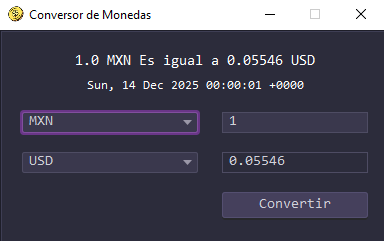

<h1 align="center">Challenge Conversor de Monedas</h1>

<p align="center">
  
  
</p>

## 📝 Descripción
Conversor de monedas simple para practicar conceptos de Java orientado a objetos y consumo de APIs. Permite convertir entre varias divisas usando tasas definidas. Este proyecto es un ejercicio educativo del programa ONE para aplicar buenas prácticas de Java Orientado a Objetos.

---

## ✨ Características
- 💰 Conversión entre monedas comunes (USD, EUR, ARS, etc.)
- ⚙ Modular: lógica de conversión separada de la interfaz.
- 🛑 Manejo de errores.

---

## 🖥 Screenshot

<p align="center">
  
</p>

---

## 🛠️ Tecnologías Utilizadas

<div align="center">
  
  | Tecnología |            Descrpción            |                            Icon                             |
  | :--------: | :------------------------------: | :---------------------------------------------------------: |
  |     Git    | Sistema de control de versiones  |    |
  |    Maven   |        Gestión de proyecto       |  |
  |    Java    |             Lenguaje             |   |
  
</div>

---

## 📂 Estructura del Proyecto

El proyecto sigue los principios de **Clean Architecture** para separar las responsabilidades y facilitar la escalabilidad. El código está organizado por módulos.

* **`view`**: Contiene los widgets (UI) y la lógica de estado.
* **`model`**: El corazón de la aplicación. Contiene las entidades, los casos de uso y los contratos (repositorios abstractos). Es independiente de cualquier framework.
* **`controller`**: Implementa los repositorios del dominio. Se encarga de obtener los datos de fuentes externas (APIs, bases de datos).

El proyecto está organizado bajo el patrón de arquitectura **MVC (Modelo-Vista-Controlador)** para separar la lógica de negocio, la interfaz de usuario y el control de flujo. A continuación se detalla la estructura de directorios y los archivos principales:

```text
├── src/main/java/com/david
│   ├── controller          # Lógica de control y coordinación
│   │   ├── App.java
│   │   └── Coordinador.java
│   │
│   ├── main                # Punto de entrada de la aplicación
│   │   └── Main.java
│   │
│   ├── model               # Lógica de negocio y definición de datos
│   │   ├── ConsultarIntercambio.java
│   │   └── Moneda.java
│   │
│   └── view                # Interfaz gráfica de usuario
│       └── VentanaPrincipal.java
│
├── .env                    # Variables de entorno (tokens, config)
├── pom.xml                 # Dependencias de Maven
└── README.md               # Documentación del proyecto
```

### Descripcion de Paquetes

- controller: Contiene las clases encargadas de conectar la vista con el modelo.
  - Coordinador.java: Gestiona el flujo de información entre la interfaz y la lógica de datos.
- main: Contiene el punto de entrada.
  - Main.java: Clase principal que inicia la ejecución del programa.
- model: Define los objetos del dominio y la lógica de negocio.
  - Moneda.java: Clase que representa la estructura de datos de una moneda.
  - ConsultarIntercambio.java: Lógica para realizar consultas (a una API externa) sobre tasas de cambio.
- view: Contiene los elementos visuales.
  - VentanaPrincipal.java: La interfaz gráfica con la que interactúa el usuario.

---

## 🚀 Instalación

Requisitos previos:
- Git
- JDK 21 o superior
- Apache Maven
- VS Code

1) Clonar el repositorio:
```bash
git clone https://github.com/Daavid-Anaya/challenge-conversor-de-monedas.git
```

2) Entrar en la carpeta del proyecto 
```bash
cd challenge-conversor-de-monedas
```

3) Compila y empaqueta el proyecto
```bash
mvn clean package
```

4) Obtener tu API key de Exchange Rate API

- Visita el sitio web oficial: Ve a https://www.exchangerate-api.com.
- Regístrate: En la página principal, busca y haz clic en el botón de registro. Generalmente dice "Sign Up" o "Get Free API Key".
- Elige el plan gratuito: Te dirigirán a la página de planes. Selecciona el Plan Gratuito (Free Plan).
- Crea tu cuenta: Llena el formulario de registro. Solo te pedirán una dirección de correo electrónico y que crees una contraseña.
- Verifica tu correo: Revisa tu bandeja de entrada. Recibirás un correo de exchangerate-api.com con un enlace para verificar tu cuenta. Haz clic en él.
- Obtén tu API Key: Una vez que inicies sesión después de verificar tu correo, serás dirigido a tu Dashboard (panel de control). Tu API key estará allí.  

5) Crear tu archivo .env

En la carpeta raíz del proyecto, crea el archivo .env. Puedes hacerlo con un editor de texto (VS Code) o con un comando:
```bash
echo .env
```
Copia tu API key y pegala en tu archivo .env.
```bash
EXCHANGE_API_KEY = tu_api_key
```

6) Ejecutar el Programa

En Visual Studio Code (VS Code) abre la carpeta del proyecto y ejecuta la clase Main.

---
